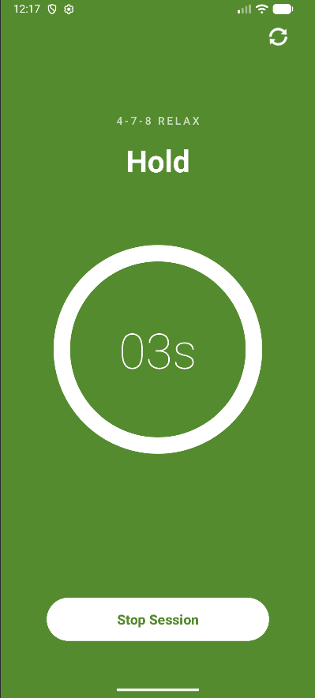
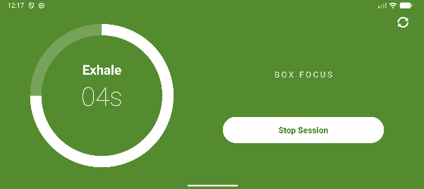

# Respira: Modern Android Breathing Aid

**Respira** is a mindfulness application designed to help users reduce anxiety and improve focus through guided breathing techniques. Built with modern Android architecture, it features a responsive UI that adapts seamlessly to any device orientation.

## App Screenshots

| Portrait Mode | Landscape Mode |
|:---:|:---:|
|  |  |

---

## Key Features

* **Dual Breathing Modes:**
    * **4-7-8 Relax:** A proven technique for anxiety reduction (Inhale 4s, Hold 7s, Exhale 8s).
    * **Box Focus:** A Navy SEAL technique for concentration (4s Inhale, 4s Hold, 4s Exhale, 4s Hold).
* **Responsive Design:** optimized layouts for both Portrait (Stacked) and Landscape (Split-Screen) using `ConstraintLayout`.
* **State Preservation:** The timer and breathing phase persist through screen rotations without resetting.
* **Visual Feedback:** A custom circular progress bar animates smoothly to guide the user's breath.

---

## Technical Architecture (MVVM)

This project follows the **Model-View-ViewModel (MVVM)** architectural pattern to ensure separation of concerns and testability.

* **ViewModel (`TimerViewModel.kt`):** Handles all business logic, including the countdown timer, state management, and the 4-7-8 logic chain. It uses `LiveData` to expose state to the UI.
* **View (`MainActivity.kt`):** Responsible only for rendering the UI. It observes the ViewModel and updates the text/progress bar automatically.
* **ViewBinding:** Replaces `findViewById` for null-safe, type-safe view interaction.
* **String Resources:** All UI text is extracted to `strings.xml` to support localization and maintainability.

---

## What I Learned

Building Respira was a deep dive into Android lifecycle management and UI design. Key takeaways include:

1.  **ConstraintLayout Mastery:** I learned how to use **Chains** (`packed`, `spread`), **Guidelines**, and **Bias** (`layout_constraintVertical_bias`) to create complex layouts that work on any screen size.
2.  **The Power of LiveData:** I discovered how `LiveData` solves the "rotation problem" by keeping data alive even when the Activity is destroyed and recreated.
3.  **Logic Chaining:** Implementing the "4-7-8" loop required chaining multiple `CountDownTimers` together, teaching me how to manage asynchronous callbacks effectively.
4.  **Clean Code:** Moving logic out of the Activity and into the ViewModel made the code much easier to read and debug.

---

## Future Roadmap

I plan to continue improving Respira with these features:

* **Daily Reminders:** Implement `WorkManager` to send a gentle notification at 9:00 AM reminding the user to take a breath.
* **Haptic Feedback:** Add subtle vibrations during phase changes (e.g., a small buzz when switching from "Inhale" to "Hold") so users can practice with their eyes closed.
* **Progress Tracking:** Save session data using `Room Database` to show users a "streak" of how many days they have practiced.
* **Dynamic Themes:** Allow users to switch between "Sage Green," "Ocean Blue," and "Sunset Orange" themes.
