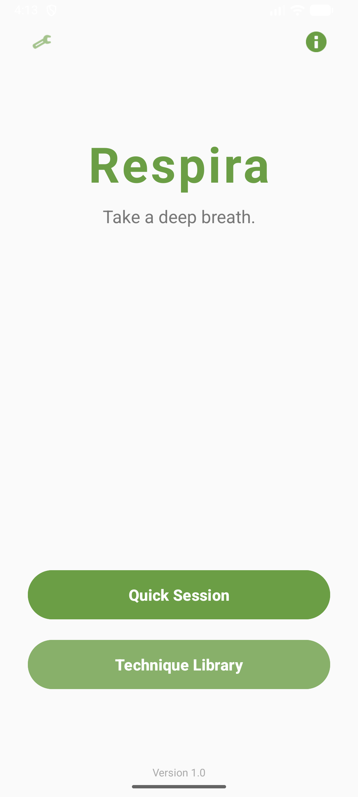
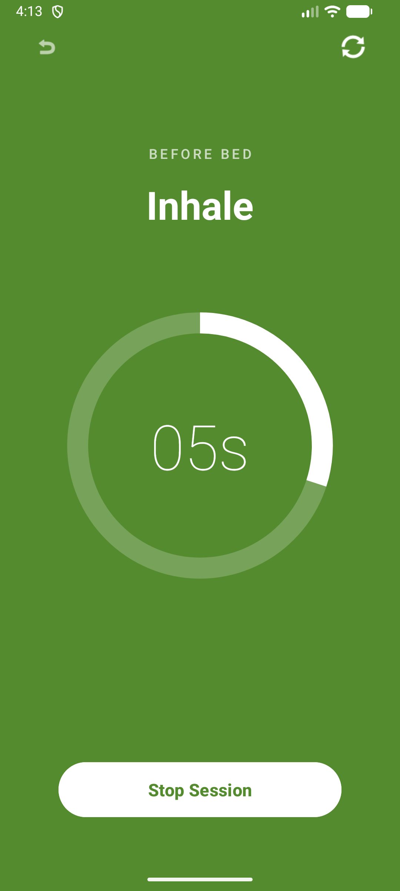
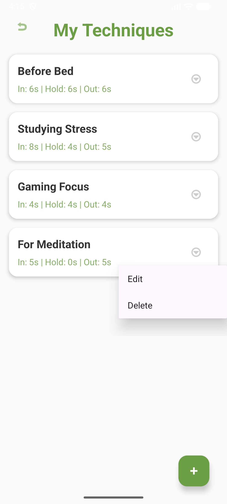
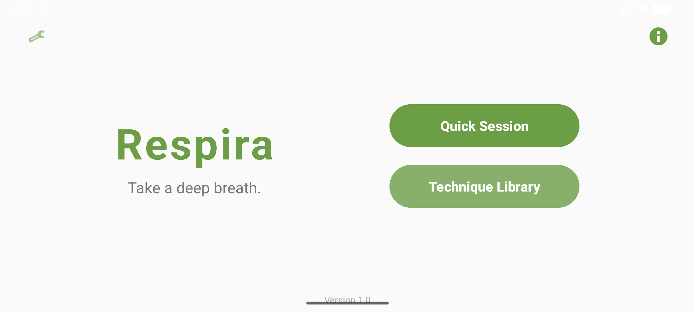
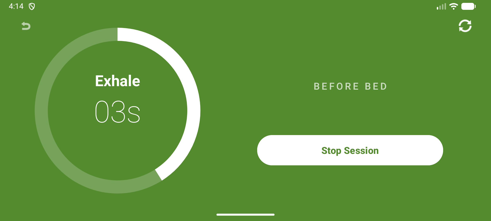

# Respira: Modern Android Breathing Aid

**Respira** is a mindfulness application designed to help users reduce anxiety and improve focus through guided breathing techniques. Built natively for Android, it features a persistent local database, asynchronous coroutines, and a responsive UI that adapts seamlessly to any device orientation.

## 🛠 Tech Stack
* **Language:** Kotlin
* **Architecture:** MVVM (Model-View-ViewModel)
* **Local Storage:** Room SQLite Database
* **Asynchrony:** Kotlin Coroutines & Flow
* **UI Components:** ViewBinding, ConstraintLayout, Material Components

---

## 📱 App Interface

### Portrait Experience
| Dashboard | Active Session | Technique Library |
|:---:|:---:|:---:|
|  |  |  |

### Landscape Optimization
| Dashboard (Landscape) | Active Session (Landscape) |
|:---:|:---:|
|  |  |

---

## ✨ Key Features

* **Custom Technique Library (CRUD):** Users can Create, Read, Update, and Delete personalized breathing rhythms. Data is saved locally using a Room Database and updates the UI instantly via Kotlin `Flow`.
* **State-Aware Timer Engine:** The countdown logic utilizes `LiveData` and ViewModels to preserve state across configuration changes (like screen rotations) without resetting the user's session.
* **Dual Default Modes:** Includes standard anxiety reduction (4-7-8 Relax) and concentration (Box Focus) techniques out of the box.
* **Responsive Design:** Optimized layouts for both Portrait (Stacked) and Landscape (Split-Screen) utilizing advanced constrained scaling and chaining.

---

## 🧠 Technical Architecture & Learnings

Building Respira was a deep dive into production-level Android development. Key technical takeaways include:

1. **Local Persistence:** Set up Entities, DAOs, and a Room Database instance, bridging the gap between volatile UI data and long-term device storage.
2. **Fragment Architecture:** Transitioned from simple Activities to lifecycle-aware `DialogFragment` popups to manage modular UI components and handle data passing between contexts safely.
3. **RecyclerView Mastery:** Implemented a dynamic `ListAdapter` with a `DiffUtil` callback for optimized list rendering, complete with a custom 3-dots popup menu for item-specific actions.
4. **Professional Tooling:** Utilized Android Studio's `tools:` namespace to bypass layout preview limitations and silence conscious design choices to achieve a perfectly clean, 0-warning accessibility build.

---

## 🚀 Getting Started

To run this project locally:
1. Clone the repository: `git clone https://github.com/yourusername/Respira.git`
2. Open the project in **Android Studio**.
3. Sync the project with Gradle files.
4. Build and run on an emulator or physical device running Android API 24+.

---

## 👨‍💻 Author

**Eduardo Bussien** 